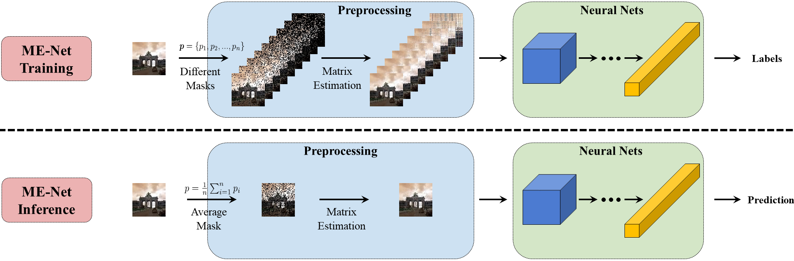
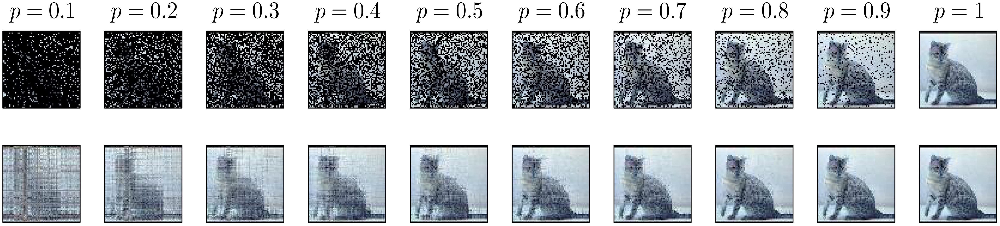
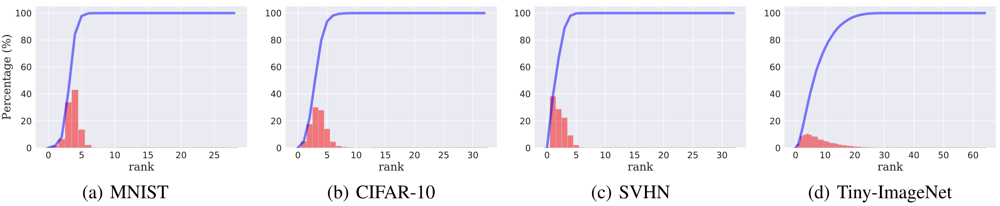
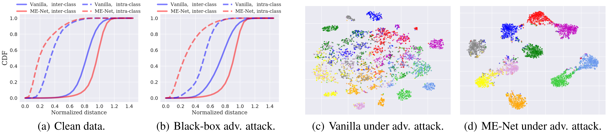
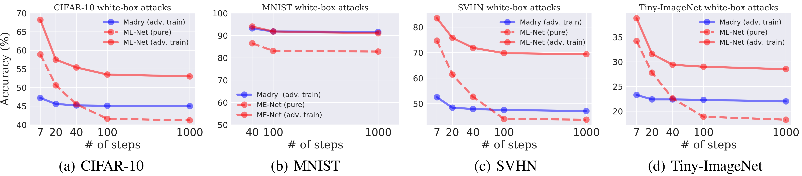

# ME-Net: Towards Effective Adversarial Robustness with Matrix Estimation

This repository contains the implementation code for paper [ME-Net: Towards Effective Adversarial Robustness with Matrix Estimation](http://me-net.csail.mit.edu/) (__ICML 2019__).

__ME-Net__ is a preprocessing-based defense method against adversarial examples, which is both model-agnostic and attack-agnostic. Being model-agnostic means ME-Net can easily be embedded into existing networks, and being attack-agnostic means ME-Net can improve adversarial robustness against a wide range of black-box and white-box attacks.
Specifically, we focus on the intrinsic _global structures_ (e.g., low-rank) within images, and leverage _matrix estimation_ (ME) to exploit such underlying structures for better adversarial robustness.




## Dependencies
The current code has been tested on Ubuntu 16.04.
You can install the dependencies using
```bash
pip install -r requirements.txt
```


## Main Files
The code provided in this repository is able to do the following tasks:

- [`train_pure.py`](train_pure.py): Train a ME-Net model with standard SGD.
- [`train_adv.py`](train_adv.py): Train a ME-Net model with adversarial training. We mainly focus on PGD-based adversarial training under L_infinity perturbation bound.
- [`attack_blackbox.py`](attack_blackbox.py): Perform black-box attacks on trained ME-Net model. We provide three kinds of black-box attacks, including transfer-based attack (i.e., using [FGSM](https://arxiv.org/abs/1412.6572), [PGD](https://arxiv.org/abs/1706.06083) and [CW](https://arxiv.org/abs/1608.04644)), decision-based attack (i.e., [Boundary attack](https://arxiv.org/abs/1712.04248)), and score-based attack (i.e., [SPSA](https://arxiv.org/abs/1802.05666)).
- [`attack_whitebox.py`](attack_whitebox.py): Perform white-box attacks on trained ME-Net model. We mainly focus on white-box adversarial robustness against L_infinity bounded PGD attack.

**Note:** The current release is for the [CIFAR-10](https://www.cs.toronto.edu/~kriz/cifar.html) dataset. We also test ME-Net on [MNIST](http://yann.lecun.com/exdb/mnist/), [SVHN](http://ufldl.stanford.edu/housenumbers/), and [Tiny-ImageNet](https://tiny-imagenet.herokuapp.com/) dataset. The main code framework is the same for different datasets, while the only difference is the dataloader.
We will update code for the remaining datasets soon.


## Train ME-Net
Matrix estimation is a well studied topic with a number of established ME techniques. We mainly focus on three different ME methods throughout our study:
- The [universal singular value thresholding (USVT)](https://arxiv.org/abs/1212.1247) approach
- The [Soft-Impute](http://www.jmlr.org/papers/v11/mazumder10a.html) algorithm
- The [nuclear norm minimization](https://arxiv.org/abs/0805.4471) algorithm

Note that one could either view the three RGB channels separately as independent matrices or jointly by concatenating them into one matrix. While the main paper follows the latter approach, we here provide an argument `--me-channel` to choose how you want to operate on the channels for ME. We provide comparison between the two methods later.

As ME-Net uses different masked realizations of each image during training, we use the following method to generate masks with different observing probability: for each image, we select `--mask-num` masks in total with observing probability ranging from `--startp` to `--endp` with equal intervals. 

### Common Arguments
The following arguments are used by scripts for training ME-Net, including [`train_pure.py`](train_pure.py), and [`train_adv.py`](train_adv.py):

#### Paths
- `--data-dir`: directory path to read data.
- `--save-dir`: directory path to store/load models.

#### Hyper-parameters
- `--model`: choose which model to use (default: `ResNet18`).
- `--mu`: the nuclear norm minimization algorithm hyper-parameter (default: `1`).
- `--svdprob`: the USVT approach hyper-parameter (default: `0.8`).
- `--startp`: the start probability of mask sampling.
- `--endp`: the end probability of mask sampling.
- `--batch-size`: the mini-batch size for training (default: `256`).
- `--mask-num`: the number of sampled masks (default: `10`).

#### ME parameters
- `--me-channel`: view RGB channels separately as independent matrices, or jointly by concatenating: `separate` | `concat` (default: `concat`).
- `--me-type`: choose which method to use for matrix estimation: `usvt` | `softimp` | `nucnorm` (default: `usvt`).


### Train ME-Net with Standard SGD
To train a pure ME-Net model with SGD, for example, using `nucnorm` with probability from `0.8 -> 1` with `concat` channels:
```bash
python train_pure.py --data-dir <path> \
    --save-dir <path> \
    --startp 0.8 \
    --endp 1 \
    --me-channel concat \
    --me-type nucnorm \
    <optional-arguments>
```

### Train ME-Net with Adversarial Training
To adversarially train a ME-Net model, for example, using `usvt` with probability from `0.4 -> 0.6` with `concat` channels, under `7` steps PGD attacks:
```bash
python train_adv.py --data-dir <path> \
    --save-dir <path> \
    --startp 0.4 \
    --endp 0.6 \
    --me-channel concat \
    --me-type usvt \
    --attack \
    --iter 7 \
    <optional-arguments>
```

### Pre-generated Datasets
Since the first step for training a pure ME-Net model is to generate a new dataset (`--mask-num` times larger), which can be time-consuming for certain ME methods.
We provide several pre-generated datasets with different observing probabilities and different ME methods (_will update soon_):

- [CIFAR-10 | nuclear norm | 0.8 -> 1 | 10 masks | concat]()
- [CIFAR-10 | nuclear norm | 0.4 -> 0.6 | 10 masks | concat]()
- [CIFAR-10 | nuclear norm | 0.8 -> 1 | 10 masks | separate]()
- [CIFAR-10 | nuclear norm | 0.4 -> 0.6 | 10 masks | separate]()
- [CIFAR-10 | soft-impute | 0.8 -> 1 | 10 masks | concat]()
- [CIFAR-10 | soft-impute | 0.4 -> 0.6 | 10 masks | concat]()

An example to load such pre-generated datasets:
```python
class CIFAR10_Dataset(Data.Dataset):

    def __init__(self, train=True, target_transform=None):
        self.target_transform = target_transform
        self.train = train

        # Loading training data
        if self.train:
            self.train_data, self.train_labels = get_data(train)
            self.train_data = np.load('/path/to/training/data/')
        # Loading testing data
        else:
            self.test_data, self.test_labels = get_data()
            self.test_data = np.load('/path/to/testing/data/')
```

## Evaluate ME-Net

### Black-box Attacks
To perform a black-box attack on a trained ME-Net model, for example, using `spsa` attack with `2048` samples:
```bash
python attack_blackbox.py --data-dir <path> \
    --ckpt-dir <path> \
    --name <saved-ckpt-name> \
    --attack-type spsa \
    --spsa-sample 2048 \
    <optional-arguments>
```
The following arguments are commonly used to perform black-box attacks:
- `--data-dir`: directory path to read data.
- `--ckpt-dir`: directory path to load saved model checkpoints.
- `--name`: the name of saved checkpoints.
- `--maskp`: the probability of mask sampling (note that for ME-Net inference we simply use the average of masking probabilities during training; one can also play with other choices such as a randomly sampled one).
- `--source`: the source model of transfer-based black-box attacks.
- `--attack-type`: `fgsm` | `pgd` | `cw` | `spsa` | `boundary`.
- `--epsilon`: the upper bound change of L-inf norm on input pixels (default: `8`).
- `--iter`: the number of iterations for iterative attacks (default: `1000`).
- `--cw-conf`: the confidence of adversarial examples for CW attack (default: `20`).
- `--spsa-sample`: the number of SPSA samples for SPSA attack (default: `2048`).


### White-box Attacks
To perform a white-box attack on a trained ME-Net model, for example, using `1000` steps PGD-based [BPDA](https://arxiv.org/abs/1802.00420) attack:
```bash
python attack_whitebox.py --data-dir <path> \
    --ckpt-dir <path> \
    --name <saved-ckpt-name> \
    --attack \
    --mode pgd \
    --iter 1000 \
    <optional-arguments>
```
The following arguments are commonly used to perform white-box attacks:
- `--data-dir`: directory path to read data.
- `--ckpt-dir`: directory path to load saved model checkpoints.
- `--name`: the name of saved checkpoints.
- `--maskp`: the probability of mask sampling (note that for ME-Net inference we simply use the average of masking probabilities during training; one can also play with other choices such as a randomly sampled one).
- `--attack`: perform adversarial attacks (default: `True`).
- `--epsilon`: the upper bound change of L-inf norm on input pixels (default: `8`).
- `--iter`: the number of iterations for iterative attacks (default: `1000`).
- `--mode`: use toolbox or pgd implementation: `toolbox` | `pgd` (default: `pgd`). Note that we provide the attack implementation using `Foolbox`, however it can not achieve as high attack success rate as the PGD implementation.


### Pre-trained Models
We provide several pre-trained ME-Net models (with both purely and adversarially trained ones) on CIFAR-10 with USVT method. Note that for different attacks, models trained with different _p_ values can perform differently (more details can be found in [our paper](https://arxiv.org/abs/1905.11971)):

- [CIFAR-10 | USVT | 0.5 | Pure | concat](https://drive.google.com/file/d/1Wo0lEyKeoRgZRDGNKnZg4zgZom10U-42/view?usp=sharing)
- [CIFAR-10 | USVT | 0.5 | Adv-train | concat](https://drive.google.com/file/d/1bzTX8hoctduIM2lQdNVflXnjFb-3CpjE/view?usp=sharing)
- [CIFAR-10 | USVT | 0.9 | Pure | concat](https://drive.google.com/file/d/108rKlyGV1RSn3Hd5V8-BWtgA8-Sgdd9t/view?usp=sharing)
- [CIFAR-10 | USVT | 0.3 | Pure | concat](https://drive.google.com/file/d/1fM-zF3IICXCH0kkXsZ9fKGQTMAmahbJF/view?usp=sharing)
- [CIFAR-10 | USVT | 0.3 | Adv-train | concat](https://drive.google.com/file/d/17tbbyi6x5YPDMpS0_j9ceJEkeCW6zMYD/view?usp=sharing)

Since the saved model contains no information about the ME-Net preprocessing, one should wrap the loaded model with ME layer. An example to load pre-trained models:
```python
# black-box attacks
model = checkpoint['model']
menet_model = MENet(model)
menet_model.eval()

# white-box attacks
net = AttackPGD(menet_model, config)
net.eval()
```


## Representative Results

### Visualization of how ME affects the input images


### Images are approximately low-rank


### Qualitative and quantitative results against black-box attacks


### Adversarial robustness under PGD-based BPDA white-box attacks



## Acknowledgements
We use the implemetation in the [fancyimpute package](https://github.com/iskandr/fancyimpute) for part of our matrix estimation algorithms.
We use standard adversarial attack packages [Foolbox](https://github.com/bethgelab/foolbox) and [CleverHans](https://github.com/tensorflow/cleverhans) for evaluating our defense.


## Citation
If you find the idea or code useful for your research, please cite [our paper](https://arxiv.org/abs/1905.11971):
```bib
@inproceedings{yang2019menet,
  title={{ME-Net}: Towards Effective Adversarial Robustness with Matrix Estimation},
  author={Yang, Yuzhe and Zhang, Guo and Katabi, Dina and Xu, Zhi},
  booktitle={Proceedings of the 36th International Conference on Machine Learning (ICML)},
  year={2019},
}
```
